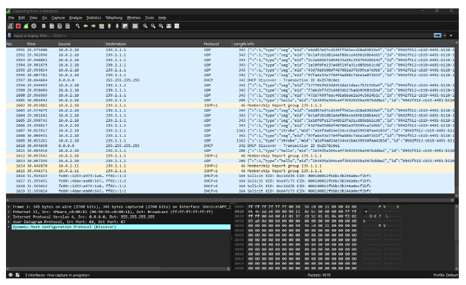
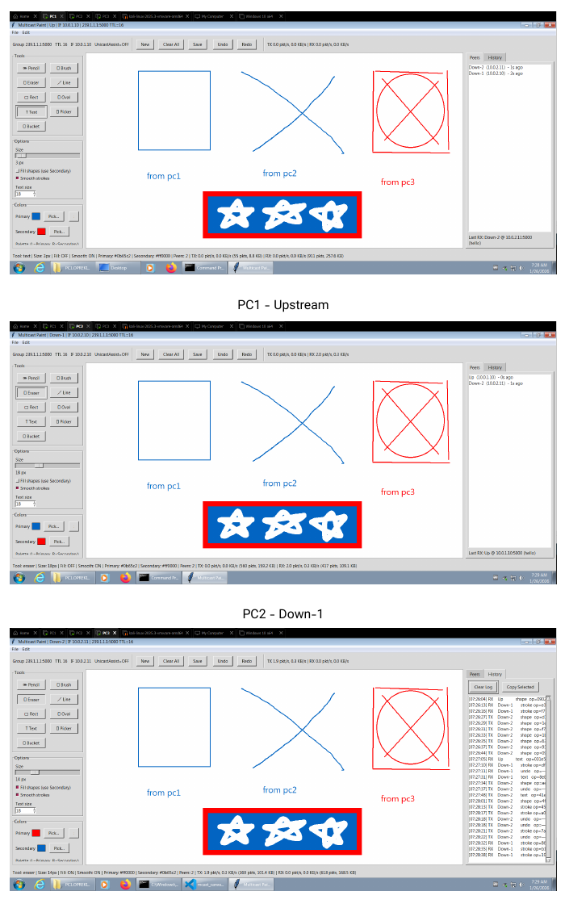
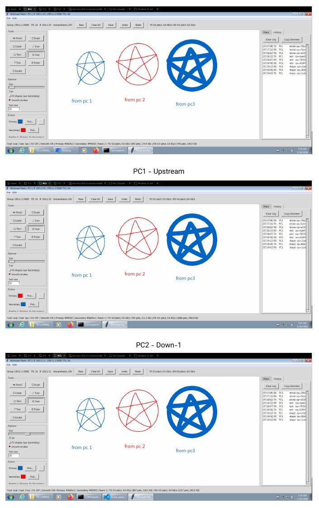
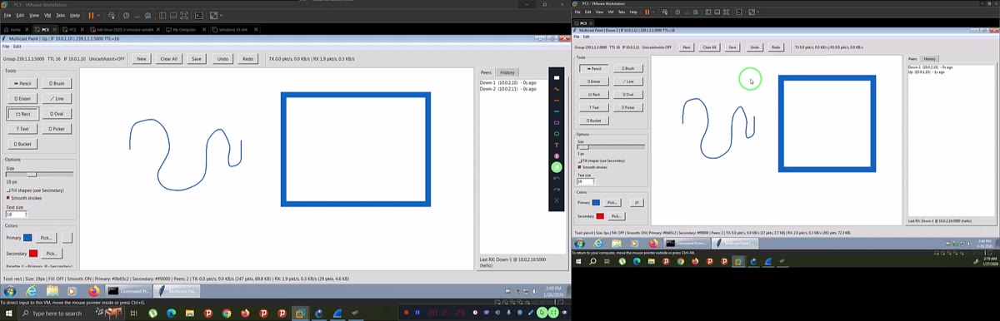
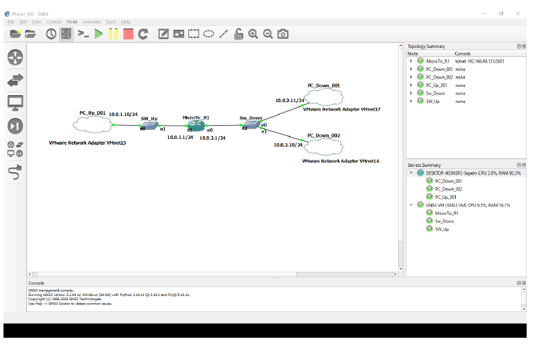

# Evidence Map

The supplied work contains multiple evidence types so the project can be evaluated at topology, router-state, packet, application, and demonstration levels.

## Reports

- `original_submission/NE_Phase_001_Sepehr_Rajabi/Phase_001_Report.pdf` - complete Phase 1 methodology, topology, configurations, packet analysis, and interpretation.
- `original_submission/NE_Phase_002_Sepehr_Rajabi/Phase_002_Report.pdf` - complete Phase 2 design, implementation details, PIM-SM / IGMP Proxy modes, application screenshots, and packet analysis.

## Packet capture

- `original_submission/NE_Phase_002_Sepehr_Rajabi/Wireshark.pcapng` - original submitted capture.
- `evidence/captures/Wireshark.pcapng` - convenient evidence-tree copy of the same supplied capture.

Recommended display filter from the report:

```text
udp.port == 5000 or igmp
```

Representative observations documented in the reports include:

- project multicast group `239.1.1.1`
- UDP port `5000`
- multicast Ethernet destination `01:00:5e:01:01:01`
- application JSON messages in Phase 2
- IGMP traffic when memberships/Scapy keepalive are active
- TTL decrease across the routed hop



## Phase 2 application results

The report shows synchronized state across PC1, PC2, and PC3 in both networking modes.

### PIM-SM



### IGMP Proxy + peer-unicast assist



## Demonstration video

Original submitted video:

`original_submission/NE_Phase_002_Sepehr_Rajabi/NE_Video.mp4`

Media metadata checked during repository preparation:

- H.264 video
- AAC audio
- 1920 x 618 video frame
- 30 fps
- approximately 9 minutes 14 seconds



## Topology figure



All images in `docs/images/` above are derived from the supplied reports/video solely to make the GitHub landing page easier to review; the original evidence remains preserved separately.
